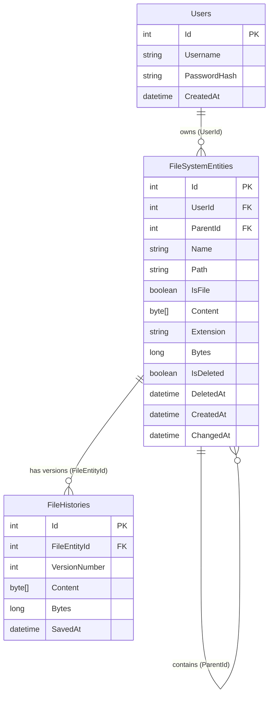
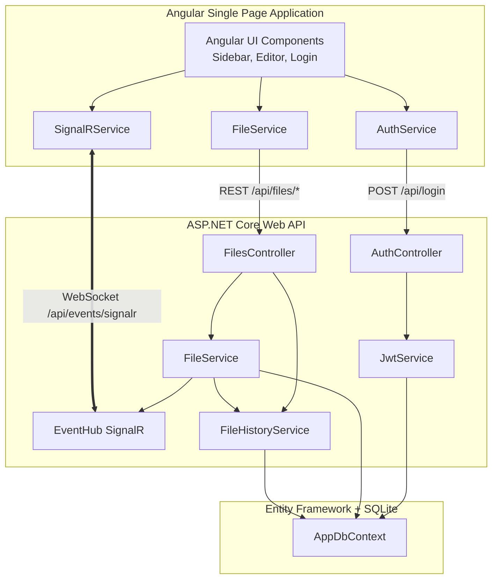
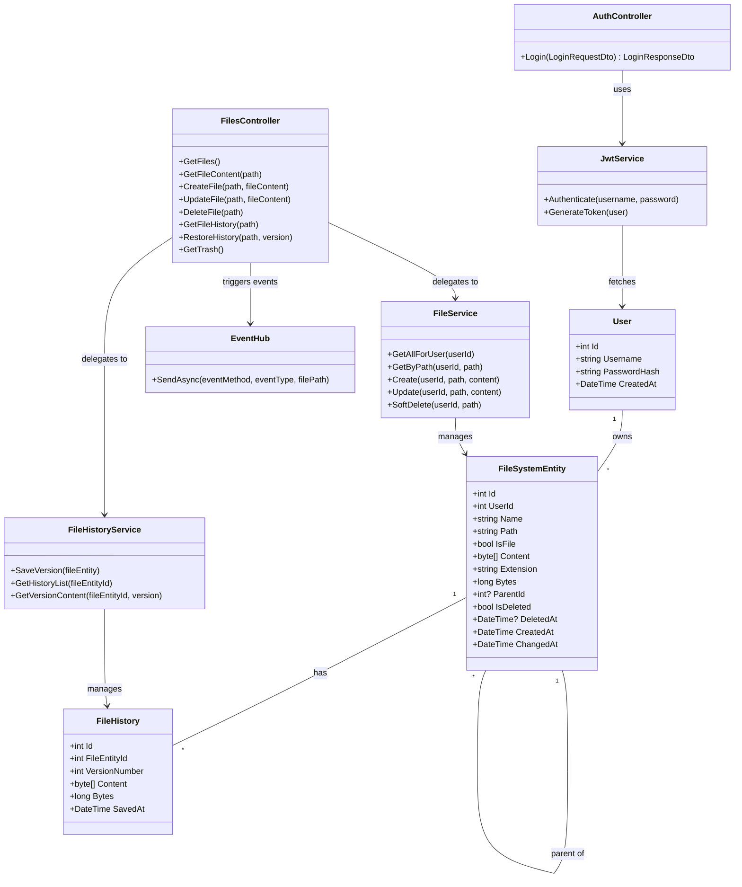

# DocGit Architecture Diagrams

This document contains visual diagrams reflecting the architecture of the **DocGit** project, based on the requirements and structures outlined in `project_architecture.md`. All diagrams are generated using Mermaid.js syntax.

## 1. Entity Relationship Diagram (ERD)

This ERD displays the database schema utilizing SQLite via Entity Framework Core. It shows the relationship between users, file-system entities, and file histories.



## 2. Data Flow Diagram (DFD)

This DFD outlines how data moves between the User (Client App), the various server processing units, and the backend data stores.

```mermaid
flowchart TD
    Client([User / Angular UI Web Client])

    subgraph ASP.NET Web API Backend
        AuthProc((Authentication\nProcess))
        FileProc((File Management\nProcess))
        HistoryProc((History & Recovery\nProcess))
        SignalRProc((SignalR Event\nHub Process))
    end

    subgraph SQLite Database
        UserDB[(Users DB)]
        FileDB[(FileSystemEntities DB)]
        HistoryDB[(FileHistories DB)]
    end

    %% Auth Flow
    Client -- "Credentials" --> AuthProc
    AuthProc -- "Validate login" --> UserDB
    AuthProc -- "JWT Token" --> Client

    %% File Management Flow
    Client -- "CRUD + JWT /api/files" --> FileProc
    FileProc -- "Query/Update" --> FileDB

    %% History Flow
    Client -- "History/Restore + JWT" --> HistoryProc
    HistoryProc -- "Query/Save versions" --> HistoryDB
    HistoryProc -- "Trigger recovery" --> FileProc

    %% SignalR Flow
    FileProc -- "Broadcast on mutation" --> SignalRProc
    HistoryProc -- "Broadcast on restore" --> SignalRProc
    SignalRProc -- "Real-time WS Event" -.-> Client
```

## 3. Component Diagram

This diagram displays the structural layout of the application frontend components, backend controllers/services, and how they connect.



## 4. Class Diagram

This class diagram represents the core Object-Oriented structure of the Backend models, services, and controllers.


