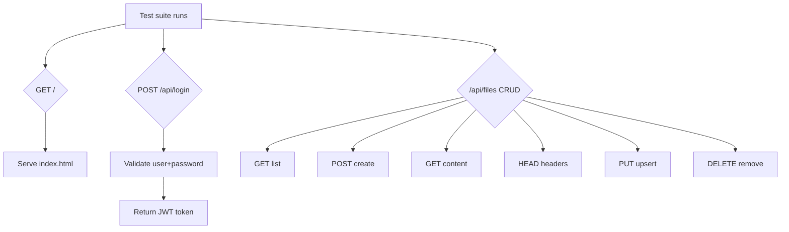

# DocGit — Plan: Week 1 + criteria + weeks 2–3

**Week 1:** the test suite checks **index.html**, **/api/login** (group), and **/api/files** (CRUD). **Weeks 2–3** and **[kriterier.md](../kriterier.md)** (course criteria) require more — see below.

_English translation of [vecka_1_backend_fix_26a8cc36.plan.md](./vecka_1_backend_fix_26a8cc36.plan.md) in this repo._

---

## 1. Serve index.html

**Problem:** Tests issue `GET /` and `GET /index.html` and expect HTML back.

**Fix in [Program.cs](../backend/Docgit/Program.cs):**

- `app.UseDefaultFiles()` + `app.UseStaticFiles()`; add `app.MapFallbackToFile("index.html")` if SPA routes should work
- `wwwroot/index.html` (simple page or built Angular copied here)

---

## 2. Fix the /api/login route

**Problem:** Tests POST to `/api/login` with `{ user, password }` and expect `{ token }`.

- Route must be **`/api/login`** (not only `/api/Auth/login`)
- DTO: **`user`** and **`password`** properties
- JSON response: **`token`** (camelCase)
- Seed **`test-user`** / **`So Long, and Thanks for All the Fish`**

**Fix:** [AuthController.cs](../backend/Docgit/Controllers/AuthController.cs), DB seed.

---

## 3. Rebuild /api/files — main work

### GET /api/files — List all files

JSON object: keys = file name (or path), values = metadata (`created`, `changed`, `file`, `bytes`, `extension`).

### POST /api/files/{path} — Create file

- Body = text; **409** if already exists
- Timestamps: `yyyy-MM-dd HH:mm:ss` (UTC)

### GET /api/files/{path} — Content

- `text/plain`

### HEAD /api/files/{path}

- Headers: `X-Created-At`, `X-Changed-At`, `X-Type`, `X-Bytes`, `X-Extension`

### PUT /api/files/{path} — Upsert

- **200 OK**; create or update

### DELETE /api/files/{path}

- **200** always (idempotent)

### Large files

- Kestrel body limit (e.g. ~100 MB) for the 64 MB test

### Folders (group)

- POST/PUT with no body → folder; GET folder → JSON; duplicate folder on POST **409**; duplicate on PUT OK; missing path **404**

---

## Code to touch (week 1)

### [Fileservice.cs](../backend/Docgit/Service/Fileservice.cs)

- `GetAllAsync`, `GetByPathAsync`, `CreateAsync`, `UpsertAsync`, `DeleteAsync` (folder variants for group if needed)

### [FilesController.cs](../backend/Docgit/Controllers/FilesController.cs)

- Routes and status codes as above
- **Solo vs group:** week-1 tests may conflict with some endpoints; **group (history)** needs trash/restore — design so trash does not break minimum tests or week 2

### [FileSystemEntity.cs](../backend/Docgit/Domain/FileSystemEntity.cs)

- `Extension` (fix typo `Extintion`)

### [Program.cs](../backend/Docgit/Program.cs)

- Static files, Kestrel body size, **no** `UseHttpsRedirection` if tests use HTTP

---

## 4. SQLite and database (criteria + week 2 history)

**Repo state:** `Program.cs` may use **SQL Server** while [kriterier.md](../kriterier.md) and [Instruktioner/Vecka 2/Historik.md](../Instruktioner/Vecka%202/Historik.md) specify **EF + SQLite**.

- Switch to `UseSqlite` and a connection string that needs no external server
- Migrations must target SQLite
- Keep **zero manual DB setup**: create/update schema + seed as needed

---

## 5. Week 2 — SignalR ([Instruktioner/Vecka 2/SignalR.md](../Instruktioner/Vecka%202/SignalR.md))

**State:** Package + empty [EventHub.cs](../backend/Docgit/Hubs/EventHub.cs); **no** `MapHub` in Program (re-verify after changes).

| Requirement | Action |
|-------------|--------|
| Hub URL | **`/api/events/signalr`** |
| After **POST, PUT, DELETE** on file API | Broadcast to all clients |
| Method | **`"Event"`** with args `(int type, string path)` |
| `path` | Same as API path: `example.txt`, `a/b/c.md` (**without** `/api/files/` prefix) |
| Types | **0** file created, **1** file updated, **2** file deleted, **5** folder created, **7** folder deleted |
| PUT | If file **new** → type **0**; if it **existed** → type **1** |
| Group | Hub **JWT-protected** like the rest of the API |

Tip: enum with explicit integer values for types.

---

## 6. Week 2 — History ([Instruktioner/Vecka 2/Historik.md](../Instruktioner/Vecka%202/Historik.md))

**State:** [FileHistory](../backend/Docgit/Domain/FileHistory.cs) + migration exist; [FileHistoryService.cs](../backend/Docgit/Service/FileHistoryService.cs) is **empty**; editor shows hardcoded “3 versions”.

| Requirement | Action |
|-------------|--------|
| Every **PUT** | Save **old** content in DB **before** replace |
| Storage | EF SQLite — e.g. full copy per row + `VersionNumber` (1, 2, 3 …) per file |
| Web | History **visible** and **interactive** — browse older/newer, **view** old content (solo: apply optional; group: restore required) |
| Group | DELETE → **deleted files list**; **restore** with history; **restore this version** button |

Optional advanced: diff/LCS or separate diff endpoint (instructions allow).

---

## 7. Week 3 — CLI client ([Instruktioner/Vecka 3/Klient.md](../Instruktioner/Vecka%203/Klient.md))

**State:** No separate C# console app in repo for `pull` / `push`.

| Requirement | Action |
|-------------|--------|
| Commands | **`pull`** and **`push`** (required) |
| 2nd arg | Server **base URL** (`localhost:3000` etc.); client adds `/api/files`, `/api/login` as needed |
| Scheme | If `http://`/`https://` missing → add **`http://`** for `localhost`, else **`https://`** |
| Errors | Cannot reach server → **exit code 1**, else **0** |
| Working dir | **`Directory.GetCurrentDirectory()`** — not the project folder when using `dotnet run` (instructions use `dotnet run --project .. --` from a test folder) |
| **Pull** | `GET /api/files`; create files (and folders for group) locally |
| **Push** | All local files → **`PUT`** `/api/files/{path}` (upsert + history) |
| **Push sync** | Files that **exist on server but not locally** must be **removed on server** |
| Login | Optional **3rd and 4th** args: username + password |
| Required file type | **Text files** (tests); other types optional |
| Bonus | **`sync`** command with SignalR real time |

---

## Flow diagram (week 1 tests)

---

## Priority order

### Week 1 (test suite — sequential)

1. index.html  
2. GET /api/files  
3. POST  
4. HEAD / GET content  
5. DELETE  
6. PUT  
7. 64 MB  
8. /api/login (group)  
9. Folders (group)  

### Then (reasonable order)

10. SQLite + warning-free build + npm run build + offline-friendly wwwroot  
11. History on PUT + API  
12. Frontend history (replace placeholder)  
13. SignalR hub + events from file API  
14. (Group) JWT on hub, trash, restore version  
15. CLI pull/push (+ push deletes on server)  
16. (Bonus) sync via SignalR  

---

## Checklist vs [kriterier.md](../kriterier.md)

Applies to **pass (G)** / **VG** regardless of week.

### G

- [ ] `dotnet build` with zero warnings (optionally `TreatWarningsAsErrors` locally)
- [ ] Start without manual external DB: SQLite + migration/seed
- [ ] Root `npm run build` copies frontend to `wwwroot` in **one** step (unless static HTML only)
- [ ] NPM/scripts work on **Windows/Mac/Linux**
- [ ] Repo-only resources — no CDN/external deps for offline-capable assets

### VG (holistic review)

- [ ] `CancellationToken` in async chains where appropriate
- [ ] Safe null handling
- [ ] Thread safety for shared mutable state
- [ ] Polymorphism/generics **when needed**, not for show

**Sanity check:** build → tests → optionally airplane mode with frontend from `wwwroot`.
