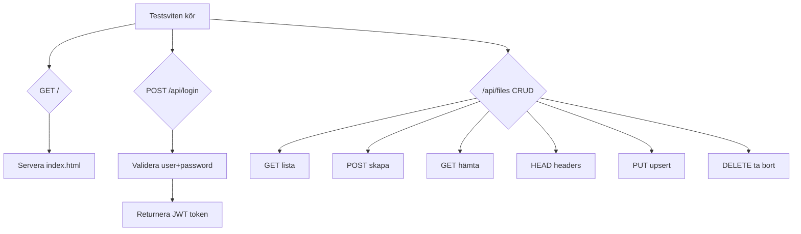

# DocGit — Plan: Vecka 1 + kriterier + Vecka 2–3

**Vecka 1:** testsviten kollar **index.html**, **/api/login** (grupp), och **/api/files** (CRUD). **Vecka 2–3** och **kriterier.md** kräver mer — se avsnitt längre ner.

_Källa: speglar planen i `.cursor/plans/vecka_1_backend_fix_26a8cc36.plan.md`._

---

## 1. Servera index.html

**Problem:** Testerna gör `GET /` och `GET /index.html` och förväntar sig HTML tillbaka.

**Fix i [Program.cs](../backend/Docgit/Program.cs):**

- `app.UseDefaultFiles()` + `app.UseStaticFiles()`; vid behov `app.MapFallbackToFile("index.html")` så SPA-rutter fungerar
- `wwwroot/index.html` (enkel sida eller byggt Angular som kopierats hit)

---

## 2. Fixa /api/login-routen

**Problem:** Testerna POSTar till `/api/login` med `{ user, password }` och förväntar sig `{ token }`.

- Route ska vara **`/api/login`** (inte bara `/api/Auth/login`)
- DTO: properties **`user`** och **`password`**
- JSON-svar: **`token`** (camelCase)
- Seeda **`test-user`** / **`So Long, and Thanks for All the Fish`**

**Fix:** [AuthController.cs](../backend/Docgit/Controllers/AuthController.cs), seed i DB.

---

## 3. Bygg om /api/files — den stora delen

### GET /api/files — Lista alla filer

JSON-objekt: nycklar = filnamn (eller sökväg), värden = metadata (`created`, `changed`, `file`, `bytes`, `extension`).

### POST /api/files/{path} — Skapa fil

- Body = text; **409** om redan finns
- Timestamps: `yyyy-MM-dd HH:mm:ss` (UTC)

### GET /api/files/{path} — Innehåll

- `text/plain`

### HEAD /api/files/{path}

- Headers: `X-Created-At`, `X-Changed-At`, `X-Type`, `X-Bytes`, `X-Extension`

### PUT /api/files/{path} — Upsert

- **200 OK**; skapa eller uppdatera

### DELETE /api/files/{path}

- **200** alltid (idempotent)

### Stora filer

- Kestrel body limit (t.ex. ~100 MB) för 64 MB-test

### Mappar (grupp)

- POST/PUT utan body → mapp; GET mapp → JSON; POST duplikat mapp **409**; PUT duplikat OK; saknad path **404**

---

## Kod att röra (Vecka 1)

### [Fileservice.cs](../backend/Docgit/Service/Fileservice.cs)

- `GetAllAsync`, `GetByPathAsync`, `CreateAsync`, `UpsertAsync`, `DeleteAsync` (ev. mapp-varianter för grupp)

### [FilesController.cs](../backend/Docgit/Controllers/FilesController.cs)

- Routes och statuskoder enligt ovan
- **OBS solo vs grupp:** Vecka 1-tester kan vilja bort med vissa endpoints; **grupp (Historik)** kräver papperskorg/återställ — planera så trash inte krockar med minimikrav utan att sabotera Vecka 2

### [FileSystemEntity.cs](../backend/Docgit/Domain/FileSystemEntity.cs)

- `Extension` (stavfel `Extintion`)

### [Program.cs](../backend/Docgit/Program.cs)

- Statiska filer, Kestrel body size, **ingen** `UseHttpsRedirection` om tester kör HTTP

---

## 4. SQLite och databas (kriterier + Vecka 2 Historik)

**Läge i repot:** `Program.cs` kan vara konfigurerad för **SQL Server** medan [kriterier.md](../kriterier.md) och [Instruktioner/Vecka 2/Historik.md](../Instruktioner/Vecka%202/Historik.md) anger **EF + SQLite**.

- Byt till `UseSqlite` och connection string som funkar utan extern server
- Migreringar ska gälla SQLite
- Behåll **start utan manuell DB**: skapa/uppdatera schema + seed vid behov

---

## 5. Vecka 2 — SignalR ([Instruktioner/Vecka 2/SignalR.md](../Instruktioner/Vecka%202/SignalR.md))

**Läge:** Paket + tom [EventHub.cs](../backend/Docgit/Hubs/EventHub.cs); **ingen** `MapHub` i Program (verifiera efter ändringar).

| Krav | Åtgärd |
|------|--------|
| Hub-URL | **`/api/events/signalr`** |
| Efter **POST, PUT, DELETE** på fil-API | Broadcast till alla klienter |
| Metod | **`"Event"`** med argument `(int type, string path)` |
| `path` | Exakt som API-sökväg: `exempel.txt`, `a/b/c.md` (**utan** `/api/files/`-prefix) |
| Typer | **0** skapad fil, **1** uppdaterad fil, **2** borttagen fil, **5** mapp skapad, **7** mapp borttagen |
| PUT | Om fil **ny** → typ **0**; om den **fanns** → typ **1** |
| Grupp | Hub **JWT-skyddad** som övriga API |

Tips: enum med explicita heltalsvärden för typerna.

---

## 6. Vecka 2 — Historik ([Instruktioner/Vecka 2/Historik.md](../Instruktioner/Vecka%202/Historik.md))

**Läge:** [FileHistory](../backend/Docgit/Domain/FileHistory.cs) + migration finns; [FileHistoryService.cs](../backend/Docgit/Service/FileHistoryService.cs) är **tom**; editor visar **hårdkodad** “3 versions”.

| Krav | Åtgärd |
|------|--------|
| Varje **PUT** | Spara **gamla** innehållet i DB **innan** ersättning |
| Lagring | EF SQLite — t.ex. full kopia per rad + `VersionNumber` (1, 2, 3 …) per fil |
| Webb | Historik **synlig** och **interagerbar** — bläddra äldre/nyare, **visa** gammalt innehåll (solo: applicera valfritt; grupp: återställ krävs) |
| Grupp | DELETE → **borttagna filer**; **återställ** med historik; knapp **återställ denna version** |

Valfritt avancerat: diff/LCS eller separat diff-endpoint (instruktionen tillåter).

---

## 7. Vecka 3 — CLI-klient ([Instruktioner/Vecka 3/Klient.md](../Instruktioner/Vecka%203/Klient.md))

**Läge:** Ingen separat C#-konsolapp i repot för `pull`/`push`.

| Krav | Åtgärd |
|------|--------|
| Kommandon | **`pull`** och **`push`** (obligatoriska) |
| Arg 2 | Server **bas-URL** (`localhost:3000` m.m.); klienten lägger själv till `/api/files`, `/api/login` vid behov |
| Schema | Saknas `http://`/`https://` → lägg till: **`http://`** för `localhost`, annars **`https://`** |
| Fel | Kan inte nå server → **exit code 1**, annars **0** |
| Arbetskatalog | **`Directory.GetCurrentDirectory()`** — inte projektmappen vid `dotnet run` (instruktionen visar `dotnet run --project .. --` från testmapp) |
| **Pull** | `GET /api/files`; skapa filer (och mappar för grupp) lokalt |
| **Push** | Alla lokala filer → **`PUT`** `/api/files/{path}` (upsert + historik) |
| **Push-synk** | Filer som **finns på servern men inte lokalt** ska **tas bort på servern** |
| Inloggning | Valfritt **3:e och 4:e** argument: användarnamn + lösenord |
| Obl. filtyp | **Textfiler** (tester); övriga filtyper valfritt |
| Bonus | Kommando **`sync`** med SignalR-realtid |

---

## Flödesdiagram (Vecka 1-tester)

---

## Prioritetsordning

### Vecka 1 (testsvit — sekventiellt)

1. index.html
2. GET /api/files
3. POST
4. HEAD / GET innehåll
5. DELETE
6. PUT
7. 64 MB
8. /api/login (grupp)
9. Mappar (grupp)

### Därefter (rimlig ordning)

10. SQLite + varningsfri build + npm run build + offline-vänlig wwwroot
11. Historik på PUT + API
12. Frontend historik (ersätt placeholder)
13. SignalR hub + events från fil-API
14. (Grupp) JWT på hub, papperskorg, återställ version
15. CLI pull/push (+ push-delete på server)
16. (Bonus) sync via SignalR

---

## Checklista mot [kriterier.md](../kriterier.md)

Gäller **G**/**VG** oavsett vecka.

### G

- [ ] `dotnet build` utan varningar (gärna `TreatWarningsAsErrors` lokalt)
- [ ] Start utan manuell extern DB: SQLite + migrering/seed
- [ ] Root `npm run build` kopierar frontend till `wwwroot` i **ett** steg (om inte bara statisk HTML)
- [ ] NPM/skript funkar på **Windows/Mac/Linux**
- [ ] Endast resurser i repot — inga CDN/externa beroenden i det som ska fungera offline

### VG (helhetsbedömning)

- [ ] `CancellationToken` i async-kedjor där det passar
- [ ] Säker null-hantering
- [ ] Trådsäkerhet vid delad mutable state
- [ ] Polymorfism/generics **vid behov**, inte för show

**Sanity-check:** bygg → tester → ev. flygplansläge med frontend från `wwwroot`.
